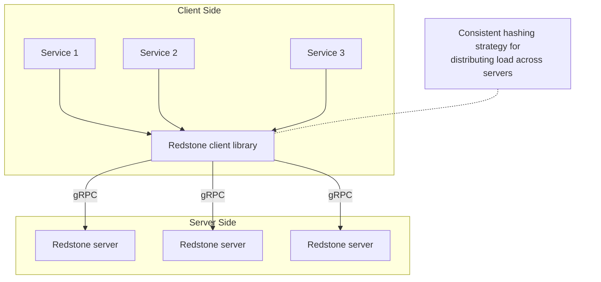

# Distributed Tensor Cache Architecture

## 1. Introduction

Machine learning inference pipelines often recompute intermediate tensors multiple times across requests, stages, or services. These recomputations are expensive in both latency and compute cost, especially when tensors are large or derived from complex preprocessing steps.

The Distributed Tensor Cache is designed to act as a low-latency, in-memory cache for tensors, allowing inference systems to store and retrieve intermediate results efficiently. By caching tensors close to where they are consumed, the system reduces redundant computation, improves tail access latency, and lowers infrastructure costs.

The design prioritizes:

* ultra-low read latency
* horizontal scalability
* immutable, write-once data

---

## 2. High-Level Architecture Overview

At a high level, the system consists of:

* Application services (e.g. ML inference pipelines).
* An embedded Redstone client library that runs on the same machine as the computation/pipeline.
* A fleet of Redstone cache servers, the clients find these via static mappings as of v0.1.0.
* A client-side consistent hashing strategy to distribute load.

---

## 3. Architecture diagram

The architecture can be broken down into three logical layers:

### 3.1 Application Services

Multiple independent services (Service 1, Service 2, Service 3 in the diagram) represent machine learning inference components or pipelines. These services may run in different processes, containers, or even clusters.

Each service links against the Redstone client library, which exposes a simple API:

* `put(key, tensor)`
* `get(key)`
* `delete(key)`

From the service’s perspective, Redstone behaves like a local cache, even though data may be stored on remote servers. This is possible by using gRPC protocol keeping costs down as well as latency low, but also allowing for scalability of the cache.

### 3.2 Redstone Client (Library)

The Redstone client is not a standalone service. It is an embedded library used directly by application services.

Its responsibilities include:

* Maintaining a consistent hashing ring.
* Mapping tensor keys to cache servers.
* Routing requests to the appropriate server over gRPC.
* Optionally retrying or failing fast based on configured policies.

By performing key-to-server mapping on the client side:

* no central router or coordinator is required.
* request latency is minimized.
* the system scales linearly as servers are added.

The client uses consistent hashing so that:

* keys are evenly distributed across servers.
* **NOTE:** This is true as long as there are no sudden failures in redstone servers, this is a known issue and will be addressed in future versions.

* adding or removing a server only remaps a small subset of keys.

### 3.3 Redstone Cache Servers

Each Redstone server is a stateless process with respect to the cluster, but stateful locally.

Each server hosts:

* a single-node in-memory tensor cache
* an LRU eviction policy
* a fixed memory budget
* immutable, write-once tensor storage

Servers expose a gRPC API that supports:

* storing tensors
* retrieving tensors
* deleting tensors
* reporting cache statistics

All servers are symmetric:

* no leader
* no primary/secondary distinction
* no cross-server coordination in the hot path

---

## 4. System Operation and Data Flow

### 4.1 Write Path (PUT)

1. An application service requests to store a tensor using a key.
2. The embedded Redstone client:
* hashes the key
* determines the responsible server using the consistent hashing ring

3. The client sends a gRPC Put request to that server.
4. The server:
* validates the tensor
* checks available memory
* evicts least-recently-used tensors if needed
* inserts the tensor atomically

5. The server responds with success or an error (e.g. out of memory, duplicate key).

Writes are immutable:

* once a key is written, it cannot be overwritten
* this simplifies concurrency and consistency guarantees

### 4.2 Read Path (GET)

1. An application service requests a tensor by key.
2. The client computes the same hash and routes the request to the same server.
3. The server:
* looks up the tensor in its local cache
* updates LRU metadata on hit

4. The tensor is returned to the client, or a cache miss is reported.

Reads are fast because:

* data is stored fully in memory
* there is no cross-node coordination
* tensor payloads are transferred directly over gRPC

### 4.3 Eviction Behavior

Each server enforces a fixed memory limit.

When inserting a new tensor:

* if there is insufficient memory, the server evicts tensors using an LRU policy
* eviction continues until the new tensor fits or the cache becomes empty
* if the tensor itself exceeds the maximum cache size, the request fails

Eviction is local to each server and does not require cluster-wide coordination.

---

## 5. Consistency and Failure Semantics

The system intentionally provides eventual consistency, not strong consistency.

Key properties:

* no read-after-write guarantee across nodes
* writes may be lost on server restart
* partial failures are acceptable
* clients must tolerate cache misses

This model aligns with the system’s role as a performance optimization, not a source of truth.

If a cache server fails:

* only the keys mapped to that server are affected
* clients naturally fail over by recomputing tensors
* no global recovery process is required

---

## 6. Why This Architecture Works Well for ML Pipelines

This design is particularly well-suited for ML inference workloads because:

* tensors are large but immutable
* recomputation is expensive but acceptable on cache miss
* latency matters more than strict consistency
* workloads scale horizontally

By combining client-side sharding, simple cache servers, and in-memory storage, the system achieves high throughput and predictable performance with minimal operational complexity.

---

## 7. Summary

The Distributed Tensor Cache architecture provides a scalable, low-latency caching layer tailored for machine learning inference pipelines. Its key strengths are simplicity, performance, and clear failure semantics.

By pushing routing logic to the client, avoiding centralized coordination, and enforcing immutable writes, the system remains robust under load while being easy to reason about and extend in the future.
