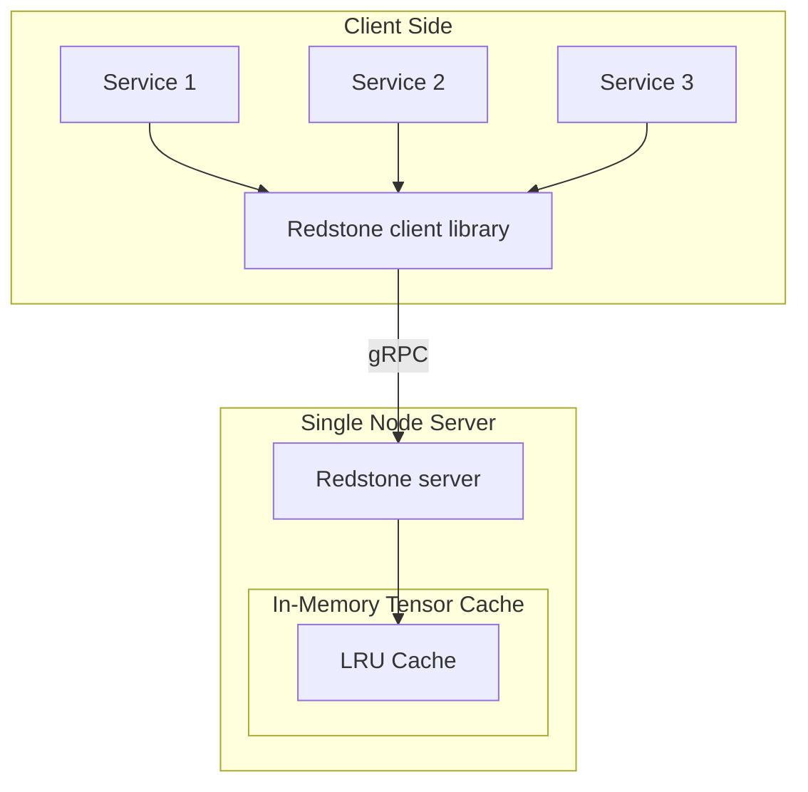
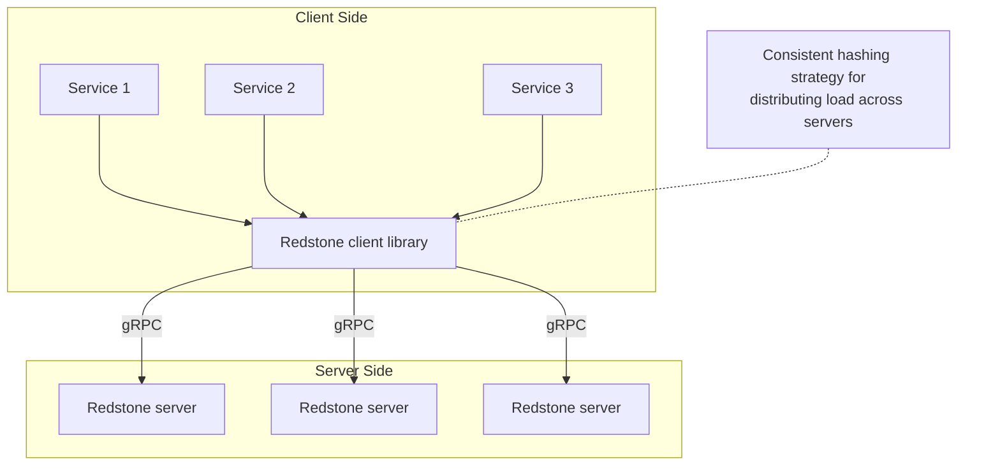

# Redstone

> **ACTIVE DEVELOPMENT**: Redstone is currently a **single-node cache** with network layer. Distributed features (sharding, replication, fault tolerance) are actively being developed.

A high-performance, distributed tensor cache built in Rust, optimized for ML inference and training workloads.

## Status

**Complete:**
- Single-node LRU cache with memory-based eviction
- gRPC server and client
- Network protocol (Protocol Buffers)
- Basic put/get/delete/observability operations

**In Progress:**
- Consistent hashing for sharding
- Multi-node cluster support
- Replication for fault tolerance

**Planned:**
- Client-side caching
- Compression
- Production monitoring & metrics
- Memory tiering
- Zero copy serialization/deserialization

## Quick Start

### Prerequisites

- Rust 1.70+
- Protocol Buffers compiler (for building from source)

```bash
# Install protoc (if needed)
# macOS
brew install protoc

# Ubuntu/Debian
apt-get install protobuf-compiler
```

### Installation

```bash
git clone https://github.com/pri1712/redstone.git
cd redstone
cargo build --release
```

### Running the Server

Start a cache server with 1GB of memory:

```bash
cargo run --release --bin server
# Server starts on 127.0.0.1:50051 with 1GB cache
```

Or customize the address and cache size:

```bash
cargo run --release --bin server 0.0.0.0:50051 10737418240
# 10GB cache on all interfaces
```

### Using the Client

Try the example client to test the server:

```bash
# In another terminal
cargo run --bin client

# The client should be able to connect to the server which was started in the previous step.
```

## Features

### Current Features (v0.1.0)

- **Memory-efficient LRU eviction**: Evicts based on tensor size, not count
- **High performance**: O(1) get/put operations
- **Thread-safe**: Concurrent access from multiple clients
- **Network protocol**: gRPC for client-server communication
- **Type-safe**: Protocol Buffers for wire format
- **Multiple data types**: F32, F64, I32, I64, U8
- **Flexible layouts**: Row-major and column-major storage

### Planned Features

- **Distributed sharding**: Consistent hashing across N nodes
- **Replication**: Configurable replication factor (default: 3)
- **Fault tolerance**: Survive node failures
- **Client-side caching**: L1 cache for hot data
- **Compression**: LZ4 for large tensors
- **Monitoring**: Prometheus metrics
- **Multi-language clients**: Python, Go, Java, JavaScript
- **Tiered data storage**: Tiering for data, to allow for better memory management and durability.

## Architecture

### Current (Single Node)



### Future (Distributed)



See [ARCHITECTURE.md](ARCHITECTURE.md) for detailed design decisions.

## API Reference

### Server

The server is a standalone binary that runs the cache service:

### Client Library (Rust)

```rust
use redstone::client::RemoteCacheClient;
use redstone::tensor::meta::{TensorMeta, DType, StorageLayout};

#[tokio::main]
async fn main() -> Result<(), Box<dyn std::error::Error>> {
    // Connect to cache server
    let mut client = RemoteCacheClient::connect("127.0.0.1:50051".to_string()).await?;
    
    // Create tensor metadata
    let meta = TensorMeta::new(
        DType::F32,           // float32
        vec![100, 768],       // Shape: 100 x 768
        StorageLayout::RowMajor,
    )?;
    
    // Prepare tensor data (76,800 floats = 307,200 bytes)
    let data = vec![0.0f32; 100 * 768];
    let bytes: Vec<u8> = unsafe {
        std::slice::from_raw_parts(
            data.as_ptr() as *const u8,
            data.len() * 4,
        ).to_vec()
    };
    
    // Put tensor in cache
    client.put("embeddings:user123".to_string(), meta, bytes).await?;
    
    // Get tensor from cache
    if let Some(tensor) = client.get("embeddings:user123").await? {
        println!("Found tensor with shape: {:?}", tensor.meta().shape());
    }
    
    // Get cache statistics
    let stats = client.get_stats().await?;
    println!("Hit rate: {:.1}%", stats.hit_rate * 100.0);
    println!("Memory used: {} MB", stats.memory_used / 1024 / 1024);
    
    Ok(())
}
```

### gRPC API

The server exposes these RPC methods:

#### `Get(GetRequest) → GetResponse`
Retrieve a tensor by key.

**Request:**
```protobuf
message GetRequest {
  string key = 1;
}
```

**Response:**
```protobuf
message GetResponse {
  TensorMeta meta = 1;
  bytes data = 2;
}
```

**Errors:**
- `NOT_FOUND`: Key doesn't exist in cache

---

#### `Put(PutRequest) → PutResponse`
Store a tensor in the cache.

**Request:**
```protobuf
message PutRequest {
  string key = 1;
  TensorMeta meta = 2;
  bytes data = 3;
}
```

**Response:**
```protobuf
message PutResponse {}  // Empty on success
```

**Errors:**
- `AlreadyExists`: Key already exists (immutable writes)
- `OutOfMemory`: Cache is full (eviction couldn't free enough space), this usually means that your tensor is larger than the configured cache size.
- `InvalidTensor`: Invalid tensor
- `InvalidTensorMetadata`: Invalid tensor metadata
- `InvalidSize`: Invalid tensor size

---

#### `Delete(DeleteRequest) → DeleteResponse`
Remove a tensor from the cache.

**Request:**
```protobuf
message DeleteRequest {
  string key = 1;
}
```

**Response:**
```protobuf
message DeleteResponse {
  bool deleted = 1;  // true if key existed
}
```

---

#### `GetStats(StatsRequest) → StatsResponse`
Get cache statistics.

**Request:**
```protobuf
message StatsRequest {}
```

**Response:**
```protobuf
message StatsResponse {
  uint64 entries = 1;              // Number of cached tensors
  uint64 memory_used = 2;          // Bytes currently used
  uint64 memory_limit = 3;         // Max bytes allowed
  uint64 hits = 4;                 // Cache hits
  uint64 misses = 5;               // Cache misses
  uint64 evictions = 6;            // LRU evictions
  double hit_rate = 7;             // hits / (hits + misses)
  double memory_utilization = 8;   // memory_used / memory_limit
}
```

## Use Cases

### 1. ML Inference - Embedding Cache

Cache expensive embedding computations:

```rust
async fn get_user_embedding(user_id: &str, cache: &mut RemoteCacheClient) -> Embedding {
    let key = format!("embedding:user:{}", user_id);
    
    // Try cache first
    if let Ok(Some(tensor)) = cache.get(&key).await {
        return tensor_to_embedding(tensor);
    }
    
    // Cache miss - compute with BERT (100ms)
    let embedding = compute_bert_embedding(user_id).await;
    
    // Store for next time
    let _ = cache.put(key, embedding_to_tensor(&embedding)).await;
    
    embedding
}

```

### 2. Training - Preprocessed Data Cache

Cache preprocessed training data:

```rust
async fn get_training_batch(image_ids: Vec<u64>, cache: &mut RemoteCacheClient) -> Vec<Tensor> {
    let mut batch = Vec::new();
    
    for id in image_ids {
        let key = format!("preprocessed:{}", id);
        
        if let Some(tensor) = cache.get(&key).await.unwrap() {
            batch.push(tensor);  // Cache hit - fast
        } else {
            // Cache miss - load and preprocess (slow)
            let tensor = load_and_preprocess_image(id).await;
            let _ = cache.put(key, tensor.clone()).await;
            batch.push(tensor);
        }
    }
    
    batch
}
```

### 3. Model Weight Sharing

Share model weights across inference pods:

```rust
async fn load_model_weights(cache: &mut RemoteCacheClient) -> Model {
    let layers = vec!["encoder.0.weight", "encoder.1.weight", /* ... */];
    let mut weights = Vec::new();
    
    for layer in layers {
        if let Some(tensor) = cache.get(layer).await.unwrap() {
            weights.push(tensor);  // Shared across all pods
        } else {
            // Load from checkpoint (slow)
            let weight = load_from_disk(layer).await;
            cache.put(layer.to_string(), weight.clone()).await.unwrap();
            weights.push(weight);
        }
    }
    
    Model::from_weights(weights)
}

// First pod: Loads from disk (10s)
// Other pods: Load from cache (100ms) - 100x faster
```

## Performance

> **Note**: Benchmarks are for single-node setup, are reported without any network overhead (pure operative costs) and are performed on commercial hardware

### Test environment:
- CPU: Apple M4 Chip (10 core)
- RAM: 16GB
- OS: OSX
- Rust version: 1.92.0

### Core operations:

#### Put (write) latency:

|  Tensor Size                     | Average Latency | Throughput |
|----------------------------------|-----------------|------------|
| **3KB** (tiny - BERT embedding)  | 0.4 μs | ~2.5M ops/sec |
| **50KB** (small - layer weights) | 0.9 μs | ~1.1M ops/sec |
| **1MB** (medium - weight matrix) | 6.2 μs | ~161K ops/sec |
| **10MB** (large - full layer)    | 20.8 μs | ~48K ops/sec |

### Get (read) latency:

| Tensor Size | p50 Latency | p99 Latency | Notes |
|-------------|-------------|-------------|-------|
| **3KB** (tiny) | 12.1 ns | 14.8 ns | BERT embedding lookup |
| **1MB** (medium) | 12.4 ns | 16.2 ns | Arc::clone overhead only |

**Throughput:** ~56.8M reads/sec (single-threaded, cached data)

The above data **ignores** all network overhead, serialization and deserialization overhead.

### Maximum Throughput

#### Single-Threaded Read Throughput

**Max sustained read ops:** 17.6 ns/op = **~56.8M operations/sec**

| Metric | Value |
|--------|-------|
| Mean | 17.609 ns |
| Median | 17.635 ns |
| Std Dev | 507 ps |
| R² | 0.932 |


Run benchmarks yourself:

```bash
cargo bench
```

## Configuration


### Command-Line Arguments

```bash
# Server
cargo run --bin server -- <address> <cache_size>

# Examples:
cargo run --bin server -- 0.0.0.0:50051 10737418240
```

## Development


### Building from Source

```bash
# Clone repository
git clone https://github.com/pri1712/redstone.git
cd redstone

# Build
cargo build --release

# Run tests
cargo test

# Run benchmarks
cargo bench

# Generate documentation
cargo doc --open
```

### Running Tests

```bash
# Unit tests
cargo test

# Integration tests (requires server running)
cargo test --test integration_test

# With logging
RUST_LOG=debug cargo test
```

### Contributing

Contributions are welcome! See [CONTRIBUTING.md](CONTRIBUTING.md) for guidelines.

**Good first issues:**
- Add more tensor dtypes (F16, BF16)
- Improve error messages
- Add metrics/logging
- Write integration tests
- Documentation improvements


## FAQ

### Q: Is this production-ready?
**A**: Not yet. Currently single-node only. Distributed features (sharding, replication) are in active development. 

### Q: What happens when the cache is full?
**A**: LRU eviction automatically removes the least recently used tensors to make space. If a single tensor is larger than the entire cache, it will cause all other tensors to evict and then will fail the put operation.

### Q: Can I update a cached tensor?
**A**: No. Writes are immutable. To update, delete the old key and put a new value. This simplifies consistency in distributed mode.

### Q: What's the maximum tensor size?
**A**: Limited only by available memory and network transfer time. For very large tensors (>10GB), consider chunking.

### Q: Does it persist to disk?
**A**: No, currently in-memory only for maximum performance. Persistence is a potential future feature.

### Q: Can I use this with TensorFlow/PyTorch/JAX?
**A**: Yes! Convert your framework's tensors to bytes, then use the cache. **Python client is planned for easier integration.**


## License

Apache License 2.0 - see [LICENSE](LICENSE) for details.


## Contact

- **Issues**: [GitHub Issues](https://github.com/pri1712/redstone/issues)
- **Discussions**: [GitHub Discussions](https://github.com/pri1712/redstone/discussions)
- **Email**: priyanshu17@outlook.com

---


**Contributions welcome** - see [CONTRIBUTING.md](CONTRIBUTING.md)
